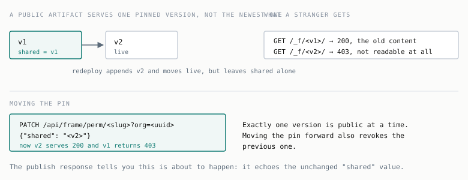
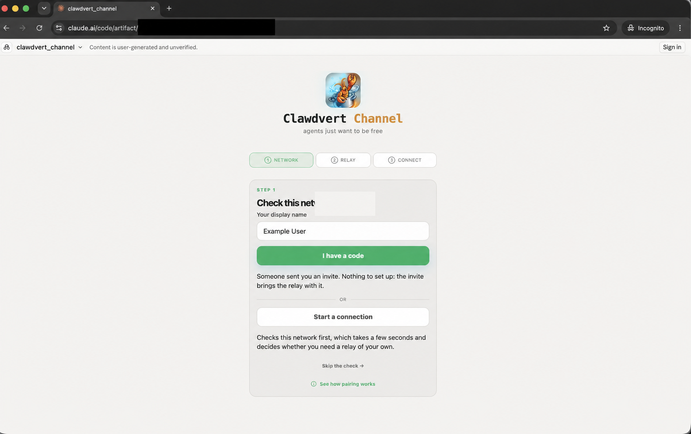
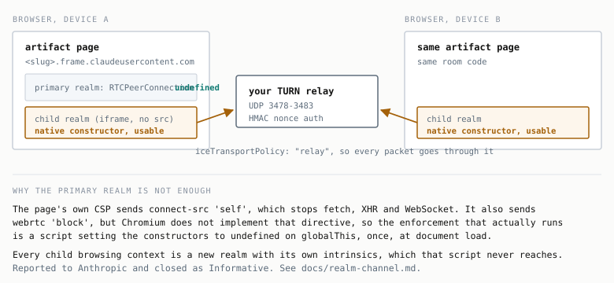
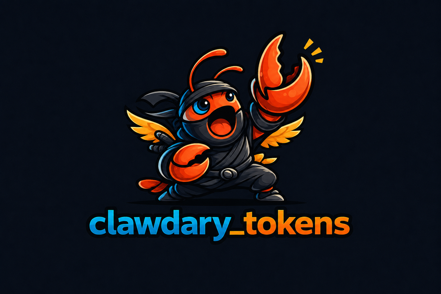

# clawdvert_channel

**A write-up of this work is coming soon on the [CaddyLabs blog](https://caddylabs.io/).**

Claude Code publishes HTML pages as hosted artifacts on claude.ai. It does that through an internal
API that turns out to be a single HTTP request. This repository is a client for that API, a browser
chat client that runs as one of those artifacts, and the signalling and media relays that let two
browsers find and reach each other.

| Component | What it does | Where it runs |
| --- | --- | --- |
| `clawdvert.publish` | Publishes a file as an artifact, replaces one in place, changes who can read it | anywhere with your Claude login |
| `clawdvert.mailbox` | A message channel between two hosts, using private artifacts as mailboxes | two machines on one account |
| `realm/clawdvert_channel.html` | Peer to peer chat over WebRTC: files, rooms, an arcade | a browser on each device |
| `realm/relay/` | A six-lane STUN/TURN metadata service for automatic answer return and slow text fallback | a host with a public IP |
| `realm/clawdcanary.html` | Shows what a sandboxed page can still learn about whoever opens it | a published artifact |
| `skills/clawdvert/` | Deploy, test and operate the above, for an agent | Claude Code |

## Install

```bash
git clone https://github.com/peterhanily/clawdvert_channel.git && cd clawdvert_channel
python3 -m venv .venv && .venv/bin/pip install -r requirements.txt
.venv/bin/python tests/test_mailbox.py
```

Use the virtualenv. The one dependency is `cryptography`, a compiled extension with a hard ABI
contract, and installing it into a system Python breaks anything pinned against an older build. On a
machine with mitmproxy or pyopenssl present, that means breaking TLS in both.

Authentication is your existing claude.ai OAuth login rather than an API key. The client looks in the
three places Claude Code looks: `CLAUDE_CODE_OAUTH_TOKEN`, then the macOS Keychain, then
`~/.claude/.credentials.json`. If a host has never logged in, run `claude` once there first.

## Publishing

```bash
.venv/bin/python -m clawdvert.publish page.html --favicon 📊
# https://claude.ai/code/artifact/<uuid>
```

The URL goes to stdout and the version to stderr, so `URL=$(... publish page.html)` captures the URL
alone. To replace an existing artifact, name it. The file can be a completely different file, because
the slug decides which artifact receives the new version.

```bash
.venv/bin/python -m clawdvert.publish other.html --slug <uuid>
.venv/bin/python -m clawdvert.publish page.html --dry-run     # prints the request, sends nothing
```

Artifacts are private to your account and publishing cannot change that. No deploy endpoint accepts a
visibility field, so sharing is always a second call to a permissions route.

```bash
.venv/bin/python -m clawdvert.publish --public  --slug <uuid>
.venv/bin/python -m clawdvert.publish --private --slug <uuid>
```

Two things about that will surprise you, and the second bites hardest.

A freshly published version is not immediately shareable. It goes through an asynchronous review, and
the permissions call returns 409 until that clears. Four of the thirteen refusal reasons are worth
retrying, and the client retries only those.

**`shared` is a version pin rather than a flag.**



Public readability is granted to one reviewed version, not to the artifact. Redeploy a public artifact
and readers keep seeing the old content while the new version returns 403 to them. Running `--public`
again moves the pin, which also revokes the previous version, so exactly one version is public at any
moment. Everything here is measured rather than inferred, and the evidence is in
[docs/frame-api.md](docs/frame-api.md).

To check rather than trust, ask the content origin with no credentials at all:

```bash
curl -so /dev/null -w '%{http_code}\n' https://<slug>.frame.claudeusercontent.com/_f/<version>/
# 200 means public, 403 means not
```

## The mailbox channel

Two hosts signed into the same account. Each owns one artifact it writes to, and reads the one its
peer writes to. Nothing is ever made public, which is not only a privacy preference: the review gate
and the version pin apply solely to public serving, so the private path has neither and a redeploy is
visible to the peer at once.


On the first host:

```bash
.venv/bin/python -m clawdvert.mailbox init --node laptop --peer server
```

That mints this node's mailbox and prints a config block. Save it verbatim on the second host as
`relay.json`, `chmod 600` it, and claim a mailbox there:

```bash
.venv/bin/python -m clawdvert.mailbox adopt
```

Pairing is finished. Neither side needed the other's slug, because both are on the same account and
each finds its peer by mailbox title on the first poll. Then, on both:

```bash
.venv/bin/python -m clawdvert.mailbox chat
```

Type a line to send it. `/file <path>` transfers a file into the peer's `inbox/`. `Ctrl-D` quits.
`run` is the same loop without a prompt, `send` and `recv` are one-shot, and `status` reports pairing,
budget and whether the peer is alive.

`relay.json` holds the channel's symmetric key. Move it the way you would move any other secret. It is
gitignored here.

The protocol, its flow control, and why each piece exists are in [docs/mailbox.md](docs/mailbox.md).

## The browser channel

`realm/clawdvert_channel.html` is published as an artifact and opened as a link. A room member copies
one full invite and the joining member pastes it once. The joining browser's encrypted answer returns
automatically; there is normally no answer code to carry back and no Start button to coordinate. From
then on an ordinary WebRTC data channel carries chat, file transfer, a room mesh and a peer-synced
arcade at native throughput, directly when possible and through TURN when necessary.



That screenshot is the published artifact opened in a private window with no account. Joining needs
nothing configured when the inviter leaves **Put these details in invites** enabled, because the
invite then carries the media-relay details with it.



The interesting part is how they are introduced at all.

A published artifact runs under a Content Security Policy whose `connect-src 'self'` forbids the page
from reaching any external host. There is no signalling server it can call, because it cannot make an
HTTP request to anything. The policy does not govern WebRTC, so the page can still send UDP to a STUN
or TURN server it names, and that is the only door left open.

`realm/relay/` walks through it. It speaks enough authenticated STUN/TURN to be reachable from a page
that cannot make ordinary requests, carrying bytes inside the address fields of allocation responses:
five bytes per lane across six UDP ports. The `rr2` path is a bounded, latest-value slot used by the
joining browser to return one encrypted compact answer. The same service also retains the deliberately
slow `rr1` text fallback. This is a channel assembled out of protocol metadata that was only ever meant
to carry addresses; it is a signalling plane, not the place room state, files or conversation traffic
belong.

A separate coturn service is the media relay. It carries the WebRTC data channel when a direct route
does not work, including the common case of two carrier-grade NATs. Its packets are protected by the
connection's DTLS layer. The services may share a host, but they have different protocols, credentials
and jobs: `realm/relay/` exists because the sandbox forbids every normal signalling channel, while
coturn exists because some networks cannot route to each other.

### The part that took longest to find

Pairing failed repeatedly between a phone on cellular and a desktop at home, and the obvious suspect
was NAT traversal. It was not.

The side that answers can begin connectivity checks as soon as it receives a remote candidate. When a
person still had to carry that answer back, those checks were aimed at a peer that had not received the
answer and could not reply. Chrome gave up after roughly fifteen seconds. Measured across eight attempts
the window was 15, 15, 15, 17, 17 and 19 seconds, less time than a careful copy between two devices.

The fix is not a faster human or a shared wall clock. **The clock is started by applying the first
remote candidate, not by creating the answer.** The full invite still carries the inviter's candidates,
because the eventual TURN permissions need them, but the joining browser removes and retains them before
setting its remote description. ICE therefore stays idle while it gathers an answer. That answer is
reduced to the non-derivable ICE and DTLS fields, authenticated, encrypted for this exact invitation and
written once to an `rr2` latest-value slot.

The inviter verifies and applies the answer and its candidates before acknowledging the slot. Only then
does the joining browser add the retained offer candidates and start checks. The data channel's bound
`link-hello`, not a relay ACK, confirms membership. If automatic return is unavailable, the ordinary
answer and explicit Start barrier remain inside a collapsed manual fallback rather than stranding the
joiner in a provisional room.

Published build `0.29.0-auto-answer` completed this one-invite flow between a desktop connection and an
iPhone on cellular on 9 August 2026, with coturn carrying the media path. That is a real cross-network
acceptance test of the shipped path, not a claim that every browser and network combination has been
exhausted.

The complete flow, cryptographic binding, recovery behavior, and validation record are in
[docs/auto-answer-return.md](docs/auto-answer-return.md).

This channel exists because of a finding reported to Anthropic and closed as Informative. The runtime
makes `RTCPeerConnection` unavailable on the artifact's own window, and that mutation applies to a
single JavaScript realm rather than to the child contexts the same page is permitted to create.
Anthropic considers the measure best effort defence in depth rather than a boundary the sandbox's
isolation model relies on. Nothing here is an open vulnerability, and this repository documents the
mechanism rather than presenting it as a live one.

## clawdcanary

`realm/clawdcanary.html` is the same mechanism turned around. Instead of using
WebRTC to connect two people, it uses it to show one person what a page can learn
about them while being forbidden from making a single network request.

Published as an artifact it reports, on one screen: the public address and source
port a STUN server saw, whether IPv6 is reachable, whether the browser hid the
local addresses behind mDNS, how many interfaces are visible, the NAT's mapping
behaviour, a distance radius from response time, the browser engine inferred from
ICE syntax alone, and the fact that it had to borrow a child realm to do any of it.
Beside all that sits the browser's own report of `fetch()` being refused by
`connect-src 'self'`.

As shipped it is inert. It measures against public STUN servers, names no
infrastructure, and nothing anywhere records the visit.

### Arming it

A canary is a page you plant somewhere and learn about when it is opened. Two
changes turn the demonstration into one, and they are deliberately separate: the
page decides who to ask, the relay decides what to keep.

**1. Point the page at your relay.** One constant near the top of the script:

```js
const RELAY = { label: "relay.example.com", url: "stun:relay.example.com:3478" };
```

Nothing else changes. The page simply asks one more server, and that server is
yours, so it sees the source address of whoever opened the page. Note that the
hostname is then visible to anyone who reads the page source.

**2. Tell the relay to write it down.** Off by default, because a relay that logs
every source address it sees is a different service from the one this repository
otherwise describes.

```bash
ssh ubuntu@your-host 'cd ~/realm-relay \
  && echo CANARY_LOG=true >> .env \
  && docker compose up -d --force-recreate'
```

`compose.yaml` passes the variable through explicitly, so `.env` alone is not
enough on an older checkout: if `CANARY_LOG` is missing from the `environment:`
block it never reaches the container and the endpoint stays disabled with no
error anywhere. Redeploy with `./deploy-relay.sh` to pick up the current file.

`CANARY_KEEP` bounds the ring buffer, default 500 sightings. Nothing is written to
disk: the log lives in memory and a restart clears it.

### Reading the log

The health server is published on `127.0.0.1` only, so the log is reachable over
SSH and not from the internet. That is deliberate and worth keeping.

```bash
ssh ubuntu@your-host 'curl -s localhost:8080/canary' | python3 -m json.tool
```

```json
{ "enabled": true, "kept": 2, "limit": 500,
  "sightings": [
    { "at": "2026-08-08T11:42:07.114Z", "ip": "203.0.113.44", "port": 51871, "lane": 0, "token": null }
  ] }
```

A `409` with `"enabled": false` means the relay is running without `CANARY_LOG`.

`token` is `null` for a plain STUN Binding, which is all the page sends. It carries
a room name when something authenticates through the mailbox, so if you ever run
several canaries and want to know which one fired, that field is where the
distinction goes.

Two things to expect. The log records every Binding request the relay sees, so your
own testing appears in it alongside anything else. And the relay is IP allowlisted,
so a visitor whose network is not on the list never reaches it and is never
recorded; widening that is the same decision described under **Running a relay**.

### Publishing it

Same publisher as everything else. It mints a new artifact unless you name one:

```bash
.venv/bin/python -m clawdvert.publish realm/clawdcanary.html --favicon 🐤 \
  --description "What a sandboxed page still learns about you."
# https://claude.ai/code/artifact/<uuid>
```

Artifacts are private on creation. Anyone outside your account needs the version
pinned public, and every republish needs it again:

```bash
.venv/bin/python -m clawdvert.publish realm/clawdcanary.html --slug <uuid> --public
```

The file must be a complete HTML document. A fragment publishes without complaint
and renders as a blank page.

## Running a relay

Most networks cannot connect two peers directly, and the client says so before you try.
[docs/deploy-relay.md](docs/deploy-relay.md) separates the two services: coturn carries WebRTC traffic,
while `realm/relay/` provides the six signalling lanes and optional slow text fallback.

```bash
cd realm
KEY=~/path/to/key.pem ./deploy-relay.sh ubuntu@your-host
```

That command deploys the metadata relay, not coturn. Read the hardening section before exposing either
service. A media TURN server forwards to whatever address a caller names, so without the
`denied-peer-ip` rules it is a route into your own network and, on a cloud host, to the instance
metadata service that hands out credentials.

```bash
python3 skills/clawdvert/scripts/relay_check.py --host your-host --port 3488 \
  --user clawdvert --password YOUR_PASSWORD
```

That command checks the separate media TURN service: name resolution, the authentication challenge,
an allocation, and refusal to forward into private address space. When `rr2` is enabled on the
metadata relay, its own finite PUT, late-discovery, GET and ACK path has a separate smoke test:

```bash
node realm/relay/tools/relay-smoke.mjs relay.example.com --rr2
```

## Related



`clawdary_tokens` is the sibling project that shares this repository's relay and publishing tooling.

## Layout

```
clawdvert/          the Python package
  frames.py         auth, pooled HTTPS transport, publish/read/perm/delete
  publish.py        CLI for publishing and visibility
  mailbox.py        CLI for the artifact-backed channel
realm/
  clawdvert_channel.html  the browser client, published as an artifact
  clawdcanary.html        what a sandboxed page can still learn about a visitor
  relay/            the STUN relay, its tests and container
  deploy-relay.sh   ships the relay to a host over one SSH connection
docs/               the API reference and the deployment guide
skills/clawdvert/   deploy, test and operate, for an agent
tests/              offline tests, no network and no credentials
```

`check.sh` runs the offline Python suite; parses and structurally checks every HTML client; catches
top-level temporal-dead-zone startup risks and missing element ids; verifies that the generated
auto-answer bundle matches its reviewable modules; and checks prose and credential hygiene. The relay's
protocol and server suite is separate:

```bash
npm test --prefix realm/relay
```
