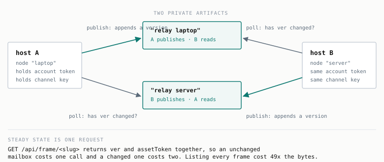

# The mailbox channel

Two hosts on one Claude account exchange messages by publishing artifacts at each other. Each node
owns one artifact it writes and reads the one its peer writes.



The artifacts are inert. Both endpoints are ordinary API clients holding the same credential, and the
artifact is a versioned blob between them. That is worth stating plainly, because it also explains
what this buys you over any other shared store, which is nothing except that it works wherever a
Claude login works.

## Why private

Making the mailboxes public would break the channel rather than open it up. Public serving adds two
mechanisms that the private path does not have.

A newly published version passes an asynchronous content review before it can be shared, so the
permissions call returns 409 for some minutes after each publish. That review would sit in the hot
path of every message.

Public readability is also pinned to a specific version, so each message would need a second call to
move the pin, and readers would see stale content until it moved. Neither applies when the reader is
the owner, which both nodes are.

## Pairing

`init` on the first host mints a mailbox and prints a config block. The second host saves that block
and runs `adopt`, which mints its own.

Neither side is told the other's slug. Both hosts are the same account, so each finds its peer by
looking for an artifact titled `relay <peer>` on the first poll, and caches the result. Pairing is
therefore a one-way copy rather than an exchange, and the only secret that moves is the channel key
already in the config.

The lookup is the only time a node lists artifacts. Everything after that addresses its peer directly.

## What a message costs

The scarce resource is publishes, not messages. A publish appends a version, and version history is
pruned at 20, but a server-side daily cap exists whose value is not public.

So sends do not publish immediately. `send` appends to an outbox and one publish carries everything
pending, which makes a rapid exchange cost the same as a single message. Under a `chat` session that
batching is invisible: each line you type flushes, but anything queued while a publish is in flight
rides along with it.

## Reading a mailbox in one request

The obvious way to detect a change is to list every artifact and compare version strings. That is
what this did originally, and it was the wrong choice twice over.

```
GET /api/frame/frames?limit=200     754 ms    43,758 bytes    90 records
GET /api/frame/<slug>?via=model_read 299 ms       895 bytes     1 record
```

The listing is 49 times larger and two and a half times slower, and it does not include the asset
token needed to read content, so a changed mailbox needed a second request anyway. The frame record
carries `ver` and `assetToken` together.

Polling the peer's record directly makes the idle case one request and the busy case two. Measured
over ten idle polls on a keep-alive connection, that is 359 ms each with no reconnects.

The transport keeps one HTTPS connection open for the life of the process. A node polls forever, and
`urllib` opens a fresh TCP and TLS connection per call, so the handshake was a per-poll cost for no
reason.

## Ordering and loss

A receiver only ever reads the current version. Anything published and replaced between two polls is
gone. So each publish carries a window of unacknowledged messages rather than only the newest, and a
peer that missed several polls still receives everything within the window.

Acknowledgements ride on the return channel and trim the window. The number acknowledged is the
highest **contiguous** sequence, never the maximum. That distinction matters: with messages 1, 2 and
5 received and 3 and 4 lost, acknowledging 5 would tell the peer to discard 3 and 4, which it still
holds and could still resend. Acknowledging 2 keeps them alive.

Three cases break the piggybacked-acknowledgement model, and each has its own mechanism.

**A receiver with nothing to say** would never acknowledge anything, so the sender's window fills and
it starts refusing sends while the peer is in fact keeping up. Nodes publish a bare acknowledgement
once they owe half a window, or once one has been outstanding for `ack_seconds`.

**A node that loses its state file** restarts at sequence 1, and a peer would dedupe those against
sequences it has already seen and discard them permanently. Each state file carries a random epoch. A
changed peer epoch resets inbound tracking, and an acknowledgement only counts if it was computed
against the current epoch, so a stale one cannot trim messages it never saw.

**A node that is simply down** sends nothing at all. Each node publishes a heartbeat when idle for
`heartbeat_seconds`, and every envelope announces its own cadence so the receiver sizes its timeout
from the sender's interval rather than its own. Two differently configured nodes therefore cannot
disagree about when the other is late. A peer that disables its heartbeat is never declared dead,
because its silence carries no information.

When the window does fill, `send` refuses with an explanation instead of dropping the oldest message.
Declining data is better than losing it, and the refusal arrives while you can still act on it.

## The wire

Each message is JSON, gzipped, sealed with ChaCha20-Poly1305, base64'd, and placed in a `<template>`
tag in an otherwise empty page.

Compression happens before encryption. The other order leaves gzip nothing to find, since ciphertext
is incompressible by construction. Compression only pays above a few hundred bytes: on a 111 byte
message gzip overhead roughly equals the payload, and the observed ratio is 1.0 to 1.1.

The channel identifier is passed as associated data, so a payload sealed for one channel fails to
open under another even with the right key. Base64 is used because its alphabet contains no `<` or
`&`, so the payload survives HTML parsing with no escaping and no size penalty.

The content origin prepends roughly 12 KB of its own runtime to every served page, so the payload is
extracted by marker rather than by assuming it is the whole body.

## Configuration

| Key | Default | Effect |
| --- | --- | --- |
| `poll_seconds` | 5 | latency is roughly half this |
| `window` | 32 | unacknowledged messages carried per publish |
| `ack_seconds` | 300 | publish a bare acknowledgement if one is owed this long |
| `heartbeat_seconds` | 1800 | publish when idle this long; 0 disables |
| `daily_cap` | 500 | local brake, not a platform limit |
| `inbox` | `inbox` | where received files land |

`relay.json` holds the channel key. It is gitignored, created `0600`, and should move between hosts
the way any other secret does.

## Operating notes

`status` reports pairing, budget, and whether the peer is alive with how much slack remains before it
is called dead.

Received files never overwrite. A name collision gets a numeric suffix. Files are capped at 8 MB so
the page stays under the 16 MB artifact limit after base64.

Redeploys are last writer wins. The API has a real optimistic concurrency protocol, `baseVersion` and
`force`, and this client uses neither, so two processes publishing to one mailbox will overwrite each
other. The single-writer-per-mailbox design avoids that by construction, which is the main reason it
is shaped that way.

## What has not been exercised

Everything here has been run, but only in bursts. No node has been left running long enough to
experience a heartbeat interval, an acknowledgement deadline, or a UTC day rollover. Those paths are
covered by offline tests against synthetic clocks rather than by observation.
